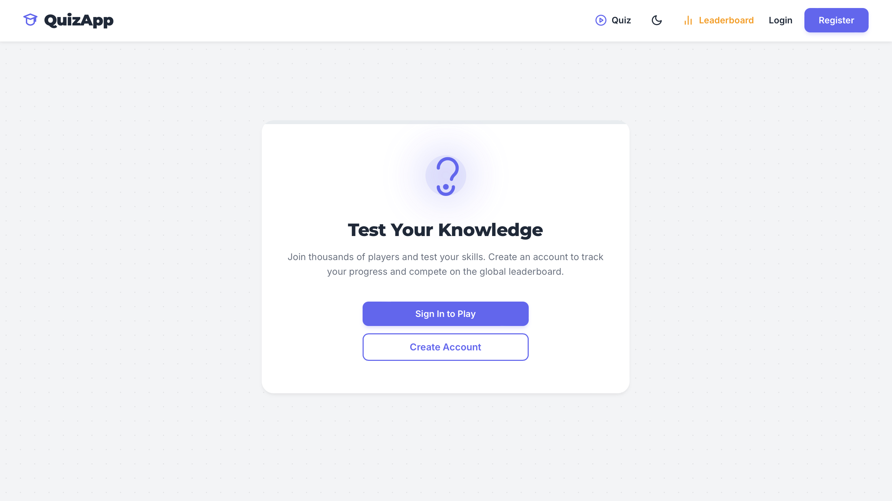
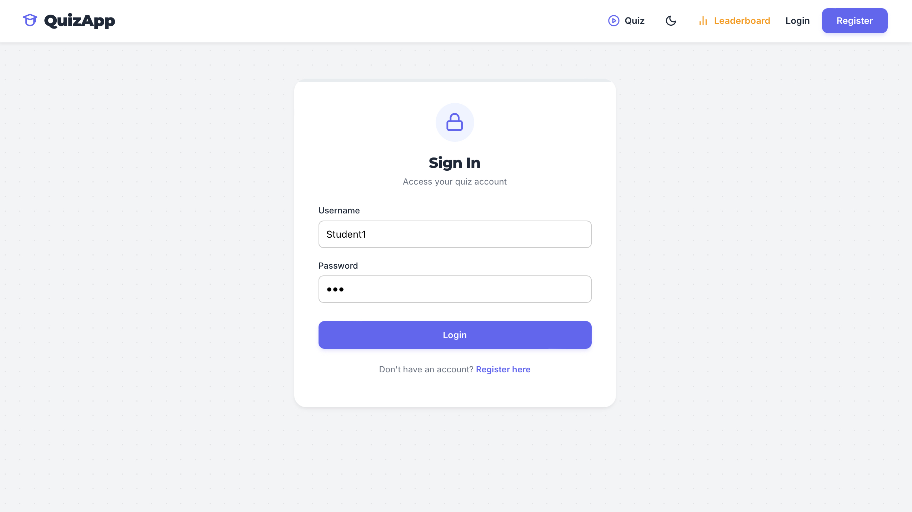
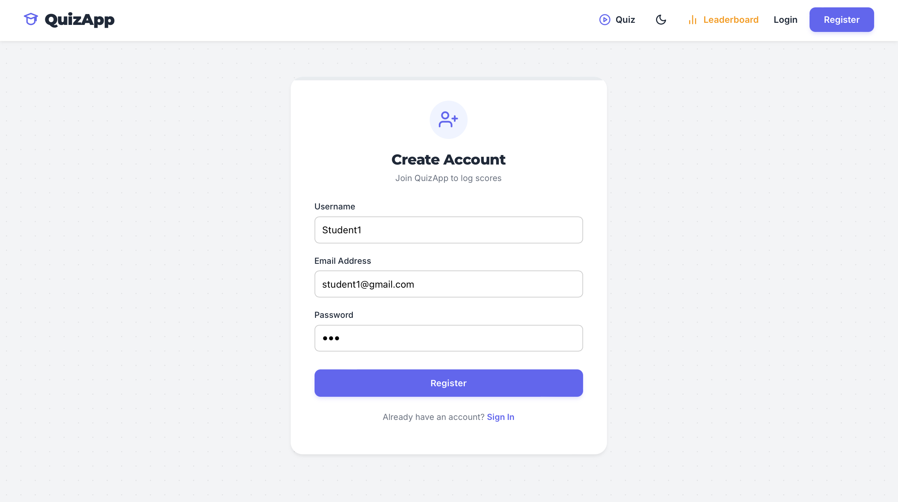
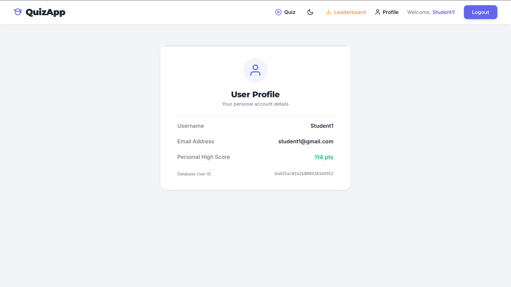
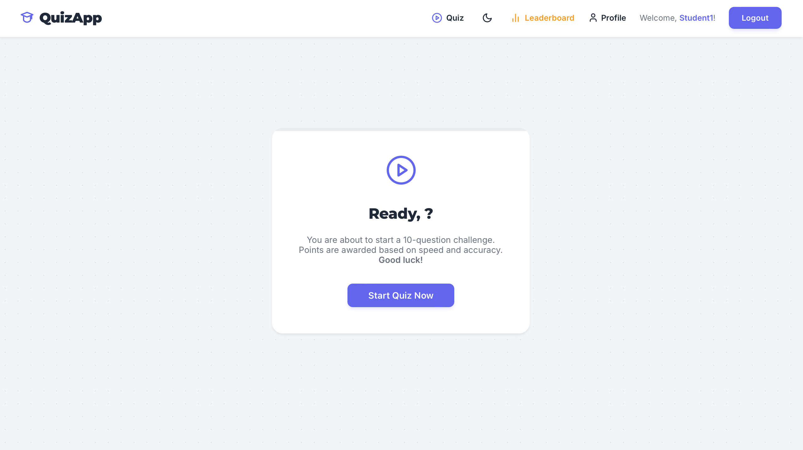
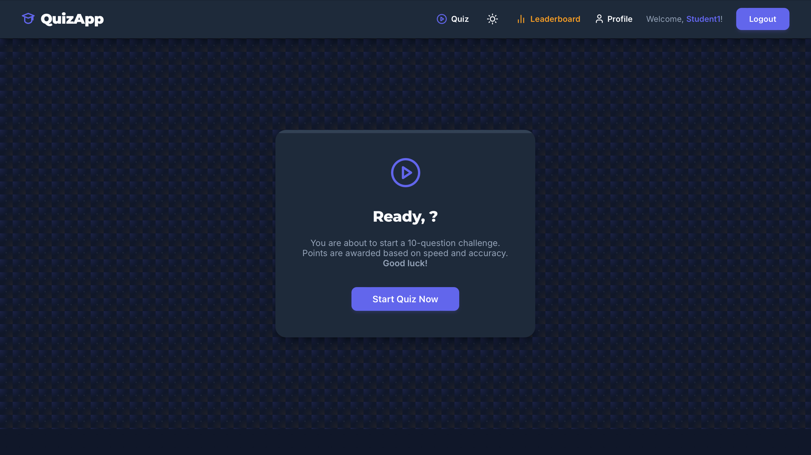
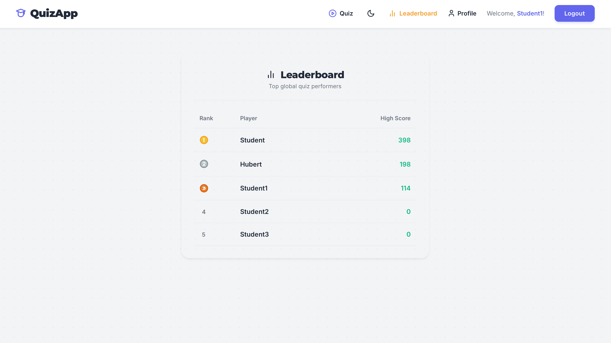

# 🧠 MERN Stack Quiz Application

A full-stack, secure online quiz solving platform built using the **MERN** (MongoDB, Express, React, Node.js) stack. Developed as part of an academic project during the **Erasmus+ Exchange Program** at the **University of Maribor**.

---

## ✨ Features

### 🔒 Core Security & Anti-Cheat Mechanisms
- **Server-Side Validation:** Question grading and score calculations occur strictly on the backend to prevent client-side tampering.
- **Server-Side Time Tracking:** Time spent on each question is measured using server sessions (timestamp recorded when answer is sent vs. when response is received).
- **Data Protection:** Correct answer keys are never sent to the frontend payload.

### 🎯 Quiz Dynamics & Mathematical Scoring
- **Dynamic Question Selection:** 10 random questions selected from an Open Trivia API database upon starting a session.
- **Custom Mathematical Score Engine:** Scores are calculated per question using the exponential decay formula:
  
  $$Score = n \cdot e^{-k \cdot t}$$
  
  *Where:*
  - $n = 100 \cdot \text{grade}$ ($\text{grade} \in [0, 1]$ based on answer correctness)
  - $k = 0.2$ (time decay coefficient)
  - $t = \text{time in seconds}$
  - $e \approx 2.71828$ (Euler's number)

### 🚀 Additional Capabilities
- **User Authentication:** Registration and login system.
- **Leaderboards & History:** Global scoreboard displaying top user scores and personal attempt histories.
- **Responsive UI:** Modern, clean, and mobile-friendly user interface built with React.

---

## 🛠️ Tech Stack

- **Frontend:** React.js, HTML5, CSS3 / Modern UI Components, Axios
- **Backend:** Node.js, Express.js
- **Database:** MongoDB, Mongoose ORM (`v6.9.0`)
- **API Integration:** Open Trivia Database API

---
## ⚙️ Local Setup & Installation

Follow these steps to run the project locally on your machine.

### Prerequisites
- **Node.js** (v16.x or higher)
- **npm** (comes with Node.js)
- **MongoDB** (MongoDB Atlas cluster or local instance)

---

### 1. Clone the Repository
```bash
git clone [https://github.com/bogychamp/mern-quiz-app.git](https://github.com/bogychamp/mern-quiz-app.git)
cd mern-quiz-app
```
### 2. Backend Setup
Navigate to the backend directory:
```bash
cd backend
```

Install dependencies:
```bash
npm install
```

Create a .env file in the backend directory (refer to .env.example):
```bash
PORT=5000
MONGO_URI=your_mongodb_connection_string
SESSION_SECRET=your_secret_key
```
Start the backend server:
```bash
npm start
```
The server will run on http://localhost:5000.

### 3. Frontend Setup
Open a new terminal window and navigate to the frontend directory:
```bash
cd frontend
```

Install dependencies:
```bash
npm install
```

Start the React/Vite development server:
```bash
npm run dev
```
Open your browser and navigate to the URL shown in the terminal (usually http://localhost:5173).
---
## 📁 Project Structure

```text
mern-quiz-app/
├── backend/
│   ├── bin/             # Server entry point setup (www)
│   ├── controllers/     # Business logic & scoring handlers
│   ├── models/          # Mongoose database schemas (User, Question, History)
│   ├── routes/          # Express API endpoints
│   ├── app.js           # Express app setup & middleware
│   └── package.json
└── frontend/
    ├── public/          # Static public assets
    ├── src/             # React views, components & logic
    ├── index.html       # Vite entry HTML
    ├── vite.config.js   # Vite configuration
    └── package.json
```

## 📸 Screenshots

<table>
  <tr>
    <td align="center"><strong>Landing Page</strong></td>
    <td align="center"><strong>Sign In Page</strong></td>
  </tr>
  <tr>
    <td></td>
    <td></td>
  </tr>
  <tr>
    <td align="center"><strong>Create Account</strong></td>
    <td align="center"><strong>User Profile</strong></td>
  </tr>
  <tr>
    <td></td>
    <td></td>
  </tr>
  <tr>
    <td align="center"><strong>Quiz Start (Light Theme)</strong></td>
    <td align="center"><strong>Quiz Start (Dark Theme)</strong></td>
  </tr>
  <tr>
    <td></td>
    <td></td>
  </tr>
  <tr>
    <td colspan="2" align="center"><strong>Global Leaderboard</strong></td>
  </tr>
  <tr>
    <td colspan="2" align="center"></td>
  </tr>
</table>
